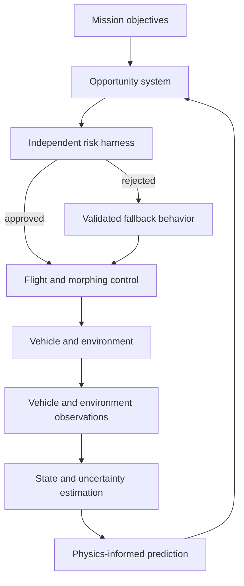

# Public Architecture Overview

## Design Principle

The intelligent system is permitted to search for opportunity, but it is not permitted to define safety. A separate harness owns the boundary between an interesting action and an acceptable action.

## Layered Intelligence

### Observation

The vehicle combines navigation, atmospheric, aerodynamic, terrain, weather, energy, and actuator observations. Sensor disagreement and missing information remain visible rather than being hidden behind one confidence value.

### State and Uncertainty Estimation

The estimator maintains a belief about both the physical flight state and changing environmental conditions. The autonomy system reasons about uncertainty explicitly because unfamiliar atmospheres cannot be represented by a single perfect estimate.

### Physics-Informed Prediction

Known flight mechanics provide the prediction backbone. Learned models may correct systematic mismatch and identify changing conditions, but they supplement rather than replace physical structure.

### Opportunity Search

The opportunity system considers coordinated changes to trajectory, flight condition, and a constrained representation of wing shape. Its objective changes with the mission phase, such as survey, transit, energy recovery, weather avoidance, landing, or relaunch.

### Risk Harness

The harness independently checks physical limits, uncertainty, energy reserve, terrain, weather exposure, actuator capability, and the ability to return to a validated state. It can reject any learned or optimized proposal.

### Execution and Recovery

Approved objectives pass to conventional feedback controllers. If observations diverge from predictions, uncertainty grows too large, or recovery becomes doubtful, the system freezes adaptation and enters an established fallback behavior.

## Why the Layers Matter

A single end-to-end learning policy would combine perception, modeling, planning, adaptation, and control in a way that is difficult to inspect or constrain. The layered approach preserves useful learning while maintaining explicit authority boundaries and understandable failure responses.

## Research Questions

- Which wing-shape variables provide enough adaptation without making online optimization intractable?
- How should atmospheric uncertainty affect geometry and route decisions?
- When is an information-gathering maneuver worth its energy and safety cost?
- How can the vehicle prove that a fallback configuration remains reachable?
- When should it avoid weather, climb, land and shelter, or resume flight?
- How can useful online learning be retained without allowing unsafe self-modification?

## Publication Boundary

This document omits implementation code, model dimensions, numerical constraints, vehicle performance values, optimization settings, detailed test scenarios, and mission-specific data. Those details require further validation before selective publication.
